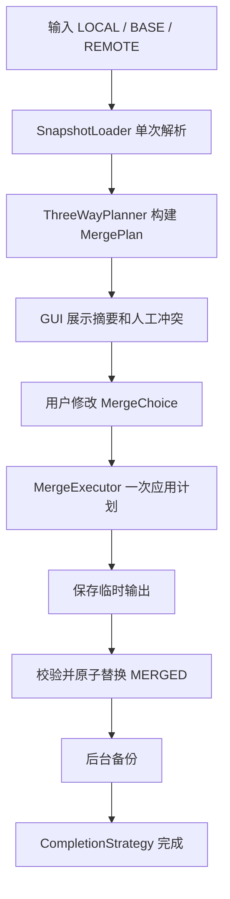

# Excel 合并正确性与性能优化方案

> 状态：审查完成，待实施
> 日期：2026-05-31
> 适用范围：现有 Fork 合并工具、对比工具、命令行回退路径
> 前置关系：本方案应优先于 `2026-05-31-global-git-excel-merge-driver-design.md` 实施

## 1. 背景

项目当前可以完成基础 Excel 三向合并和二向对比，并已具备：

- Fork Merge Tool 与 Diff Tool 集成。
- 多 Sheet 读取、首列 Key 匹配、冲突选择和结果备份。
- GUI 预览后台计算、Treeview 分页展示、同秒备份目录去重。
- 轻量模式 A-E 测试和一组回归测试。

现有测试全部通过，但专项审查发现，当前实现仍存在两类问题：

1. **正确性问题**：部分路径会静默丢失改单、公式、样式或工作簿元数据；确认合并时还存在误删真实源文件的风险。
2. **扩展性问题**：大表、冲突较多或结构变更较多时，会反复打开工作簿、扫描全表和保存临时文件，耗时从秒级快速增长到分钟级。

本方案的目标不是只修复单个热点，而是将核心流程调整为：

```text
输入校验
  -> 单次解析 LOCAL / BASE / REMOTE
  -> 构建 MergePlan
  -> GUI 预览与冲突选择
  -> 单次应用 MergePlan
  -> 单次保存 MERGED
  -> 备份与完成策略
```

## 2. 优化目标

### 2.1 正确性目标

- 三向合并必须保留所有无冲突的单侧修改。
- 发生冲突时，仅要求用户处理真正冲突项。
- 默认合并不得丢失公式、样式、隐藏 Sheet、冻结窗格、筛选器、数据验证、超链接等元数据。
- 任何情况下不得误删真实项目文件。
- `git add` 失败时不得提示冲突已成功解决。
- 公式、合并单元格和不支持的复杂工作簿必须有明确处理策略，不得静默损坏。

### 2.2 性能目标

- LOCAL、BASE、REMOTE 每份文件在一次预览中最多解析一次。
- 同一次预览生成结果时复用已有分析结果，不重新扫描全表。
- 合并过程最多保存一次最终结果，必要的安全临时文件除外。
- 冲突选择写回不得随“冲突数 × 全表大小”线性放大。
- 大表操作必须运行在后台线程，并提供进度状态和取消能力。

### 2.3 兼容性目标

- 保持现有四参数合并模式和二参数对比模式兼容。
- 继续支持 Windows 和 Python 3.7+。
- 继续使用 `openpyxl` 作为 `.xlsx` 主要读写实现。
- `.xls` 不纳入支持范围。
- `.xlsm` 在宏保留能力完成前保持“不支持或显式警告”。

## 3. 审查范围

本次审查覆盖：

| 模块 | 审查重点 |
|------|----------|
| `Scripts/MergeExcelFork.py` | 参数解析、GUI 回退、锁文件生命周期 |
| `Scripts/merge_gui.py` | 默认选项、预览刷新、同步阻塞、详情弹窗、确认流程 |
| `Scripts/diff_gui.py` | 后台对比、分页、临时文件处理 |
| `Scripts/preview_core.py` | 预览数据加载、重复读取、冲突检测调用 |
| `Scripts/conflict.py` | 三向冲突算法、内存占用、列扫描 |
| `Scripts/merge_core.py` | 合并管道、结构操作、冲突写回、诊断扫描 |
| `Scripts/compare_core.py` | 只读扫描、公式对比、输出规模 |
| `Scripts/excel_io.py` | Key 规范化、合并单元格缓存、表头迭代器 |
| `Scripts/backup_util.py` | 备份复制、Git 项目名获取 |
| `Scripts/git_util.py` | `git add`、临时文件清理、安全边界 |
| `TestData/` | 现有模式测试与回归测试覆盖面 |

## 4. 基准测试结果

### 4.1 当前仓库样例

真实 `Data_Language` 样例当前规模较小：

| 场景 | 耗时 |
|------|-----:|
| 默认 GUI 预览 | `0.25s` |
| 默认生成结果并备份 | `1.28s` |

当前日常文件尚可使用，但规模增长后耗时会明显放大。

### 4.2 通用大表

构造 5,000 行 × 40 列工作簿进行测试：

| 场景 | 耗时 |
|------|-----:|
| 单独三向冲突检测 | `7.03s` |
| 默认 GUI 预览 | `8.06s` |
| 默认生成结果并备份 | `9.53s` |
| 常规格式二向对比读取 | `3.10s` |
| 结构预览，不启用冲突检测 | `3.20s` |
| 双击查看单行详情 | `4.56s` |
| 双击查看单列详情 | `4.64s` |
| 合并后诊断日志重新打开并扫描结果文件 | `2.29s` |

### 4.3 结构变更

构造 3,000 行 × 30 列工作簿进行测试：

| 场景 | 耗时 |
|------|-----:|
| 新增 1 列 | `2.90s` |
| 新增 10 列 | `4.39s` |
| 新增 30 列 | `11.04s` |
| 新增 50 行 | `4.32s` |
| 新增 200 行 | `8.26s` |
| 新增 500 行 | `21.55s` |
| 删除约 30 行 | `4.90s` |
| 删除约 300 行 | `24.79s` |
| 删除约 1,500 行 | `78.50s` |

结构变更存在明显非线性增长。

### 4.4 冲突选择写回

构造 3,000 行 × 30 列工作簿：

| 场景 | 耗时 |
|------|-----:|
| 应用 1 个行冲突选择 | `4.07s` |
| 应用 10 个行冲突选择 | `5.65s` |
| 应用 50 个行冲突选择 | `9.76s` |
| 应用 100 个行冲突选择 | `14.45s` |

### 4.5 内存占用

| 场景 | Python 分配峰值 |
|------|----------------:|
| 3,000 行 × 30 列，全部冲突，执行三向冲突检测 | `113.9MB` |
| 3,000 行 × 30 列，全部冲突，保留默认预览结果 | `114.2MB` |
| 单个 3,000 行 × 60 列合并区域，构建坐标缓存 | `24.4MB` |

GUI 当前最多缓存 6 份预览结果，因此高冲突工作簿存在进一步放大内存的风险。

## 5. 正确性问题清单

### 5.1 P0：确认合并可能删除真实源文件

位置：`Scripts/git_util.py`

当前 `_is_temp()` 只要发现路径包含 `temp`、`tmp`、`fork` 或 `appdata` 就将文件视为临时文件。项目目录本身包含 `ForkExcelMergeTool`，因此真实文件也会匹配 `fork`。

风险：

- 点击“确认无误并解决冲突”后，LOCAL、BASE、REMOTE 真实文件可能被删除。
- 项目名、父目录名或用户名中只要包含相关字符串，就会误判。

优化要求：

- 只允许删除明确登记的隔离临时目录内文件。
- 引入 `CleanupPolicy`，默认拒绝删除未知路径。
- 使用 `os.path.commonpath()` 校验文件必须位于允许清理的根目录。
- 删除前记录路径、来源和策略判断结果。
- 禁止通过模糊字符串匹配决定删除。

### 5.2 P0：`git add` 失败仍提示完成

位置：`Scripts/git_util.py`、`Scripts/merge_gui.py`

当前 `stage_merged_and_cleanup()` 只记录 `git add` 失败，不返回结构化结果。GUI 随后仍弹出“冲突已解决”提示并退出。

优化要求：

- 返回 `CompletionResult(success, staged, cleaned, errors)`。
- `git add` 失败时停止清理，不关闭窗口，不提示成功。
- 将失败信息显示给用户并保留结果文件。
- 补充“仓库外运行”“Git 不存在”“MERGED 不在仓库中”测试。

### 5.3 P1：非冲突的单侧修改会静默丢失

位置：`Scripts/conflict.py`、`Scripts/merge_core.py`

当前选项管道以某一侧为底，只自动处理结构变化和显式冲突。若 LOCAL 与 BASE 相同、REMOTE 修改了某行，该修改不会被写入；反向情况同样存在。

正确的三向规则应为：

| BASE | LOCAL | REMOTE | 结果 |
|------|-------|--------|------|
| 相同 | 相同 | 修改 | 自动采用 REMOTE |
| 相同 | 修改 | 相同 | 自动采用 LOCAL |
| 相同 | 修改 A | 修改 A | 自动采用任一侧 |
| 相同 | 修改 A | 修改 B | 冲突，用户选择 |
| 有 | 删除 | 未改 | 自动删除 |
| 有 | 未改 | 删除 | 自动删除 |
| 有 | 删除 | 修改 | 冲突，用户选择 |
| 无 | 新增 | 无 | 自动新增 |
| 无 | 无 | 新增 | 自动新增 |
| 无 | 新增 A | 新增 B | 冲突，用户选择 |

优化要求：

- 以 BASE 为判定中心，不以 LOCAL 或 REMOTE 作为语义基准。
- 将自动采用 LOCAL、自动采用 REMOTE、自动删除、自动新增和人工冲突全部写入统一 `MergePlan`。
- GUI 的“基准侧”仅决定格式来源和默认冲突选择，不得决定是否丢失另一侧无冲突修改。

### 5.4 P1：默认合并会丢失工作簿元数据

位置：`Scripts/merge_gui.py`、`Scripts/merge_core.py`

默认启用 `E`，管道会执行 `_merge_mode_c_impl()`。该函数即使没有新增 Sheet，也会新建 Workbook 并逐单元格复制。

已复现丢失：

- 冻结窗格。
- 自动筛选。
- 数据验证。
- 超链接。
- 隐藏 Sheet 状态。

还需纳入测试：

- Sheet 保护、工作簿保护。
- 打印设置、页边距、分页符。
- 条件格式、命名区域。
- 表格、图表、图片、批注。
- 外部链接和公式关系。

优化要求：

- 没有新增 Sheet 时完全跳过 Sheet 重建。
- 以完整工作簿副本为输出基础，只应用必要变更。
- 新增 Sheet 时使用集中式 `clone_worksheet_complete()`，并建立元数据测试矩阵。
- 对暂时无法完整克隆的对象明确警告或拒绝自动合并。

### 5.5 P1：插行、删行、插列、删列会破坏公式和合并单元格

位置：`Scripts/merge_core.py`

`openpyxl` 的 `insert_rows()`、`delete_rows()`、`insert_cols()`、`delete_cols()` 不会自动完整维护所有公式、依赖关系和合并区域。当前代码只手动移动部分合并范围，没有统一坐标映射。

优化要求：

- 引入 `CoordinateTransform`，统一记录旧坐标到新坐标映射。
- 合并单元格、公式、数据验证、条件格式、命名区域等统一通过映射更新。
- 使用连续区间批量变更，避免逐行逐列修改。
- 对无法可靠转换的复杂公式或外部引用给出阻断提示。
- 首期可采用保守策略：检测到结构变更和复杂公式同时存在时，要求用户确认风险或拒绝自动结构合并。

### 5.6 P1：GUI 回退命令行会丢公式和样式

位置：`Scripts/MergeExcelFork.py`、`Scripts/merge_core.py`

GUI 初始化失败后会进入旧模式 `E`。旧模式使用 `data_only=True` 加载并重建工作簿，公式可能变成缓存值或 `None`，样式也不会完整保留。

优化要求：

- 删除旧重建路径，命令行与 GUI 统一调用新的 `MergePlan` 管道。
- 加载需要写回的工作簿时统一使用 `data_only=False`。
- 回退路径必须和 GUI 路径共享相同正确性测试。

### 5.7 P2：对比模式漏报公式变化

位置：`Scripts/compare_core.py`

当前对比使用 `data_only=True`，公式 `=1+1` 和 `=1+2` 在缓存值缺失时会被视为相同。

优化要求：

- 对比默认使用 `data_only=False`。
- 如需展示计算值，单独可选加载缓存值，不得替代公式文本比较。
- 增加公式变化、公式与常量变化、缓存为空测试。

### 5.8 P2：Key 规范化会导致碰撞或异常

位置：`Scripts/excel_io.py`

当前使用 `float()` 规范化 Key：

- `9007199254740993` 会错误转换为 `9007199254740992`。
- `1e309` 和 `INF` 会触发 `OverflowError`。
- 带前导零的业务 ID 可能被错误折叠。

优化要求：

- 使用 `decimal.Decimal` 或受限正则处理纯数字。
- 仅在确认是普通十进制数字时执行 `1` 与 `1.0` 兼容。
- 保留前导零业务 ID，除非配置明确允许折叠。
- 捕获 `ValueError`、`OverflowError`、`InvalidOperation`。
- 增加长整数、科学计数法、前导零、空值、Unicode 文本测试。

### 5.9 P2：列冲突写回位置错误

位置：`Scripts/merge_core.py`

当 LOCAL 与 REMOTE 列顺序不同，当前 D 模式直接使用来源文件列号写入目标文件，可能覆盖错误列并产生重复表头。

优化要求：

- 目标列必须按规范化表头在输出表中定位。
- 来源列和目标列分别查找，不允许复用来源索引。
- 重复表头必须显式报错或使用稳定唯一列标识。

### 5.10 P3：参数中包含逗号时会被错误拆分

位置：`Scripts/MergeExcelFork.py`

当前无条件对每个参数执行 `split(",")`。合法文件名如 `local,copy.xlsx` 会被破坏。

优化要求：

- 已收到 2 个或 4 个独立参数时不得再次拆分。
- 仅在收到单个聚合参数时按兼容模式拆分。
- 使用 `csv` 解析带引号的逗号参数。

### 5.11 P3：锁文件生命周期不完整

位置：`Scripts/MergeExcelFork.py`、`Scripts/log_util.py`

GUI 获取锁后若初始化失败并回退命令行，锁没有在 `finally` 中释放。仓库历史中还曾提交锁文件。

优化要求：

- 锁文件不得纳入 Git 跟踪。
- 所有获取锁的入口使用 `try/finally`。
- 锁内容增加 PID、启动时间和模式，便于诊断。
- 增加 GUI 初始化失败、异常退出、重复启动测试。

## 6. 性能问题清单

### 6.1 P1：默认预览重复加载 5 份工作簿

位置：`Scripts/preview_core.py`、`Scripts/conflict.py`

默认预览先打开基准侧和另一侧做结构预览；启用 `G` 后，又打开 LOCAL、BASE、REMOTE 做冲突检测。

优化要求：

- 新增 `WorkbookSnapshot`，一次解析后供结构预览、冲突检测和详情查询复用。
- `build_merge_preview()` 接收快照或 `MergePlan`，不得内部重新打开文件。
- 文件签名变化时才失效缓存。

### 6.2 P1：生成结果在 Tk 主线程同步执行

位置：`Scripts/merge_gui.py`

预览已经后台化，但点击“生成合并结果”后仍同步调用 `do_merge()`。大文件时窗口会冻结。

优化要求：

- 合并生成、保存和备份全部运行在后台线程。
- 主线程只更新进度、按钮状态和结果提示。
- 生成期间禁用重复点击，保留取消入口。
- 取消时停止后续阶段，不留下半写入结果。

### 6.3 P1：选项管道反复加载和保存临时工作簿

位置：`Scripts/merge_core.py`

当前每种选项都执行一次：

```text
load_workbook()
  -> 修改
  -> save()
  -> os.replace()
```

最坏路径会连续执行增行、删行、增列、删列、新增 Sheet、删除 Sheet、冲突写回。

优化要求：

- 将所有操作先汇总到 `MergePlan`。
- 一次加载输出基础工作簿。
- 在内存中依次应用变更。
- 最终只保存一次安全临时文件，再原子替换目标文件。

### 6.4 P1：结构操作逐条移动单元格

位置：`Scripts/merge_core.py`

逐条调用 `insert_rows()` 和 `delete_rows()` 会反复移动后续单元格，是删除 1,500 行耗时 `78.50s` 的主要原因。

优化要求：

- 将相邻新增或删除坐标合并为连续区间。
- 删除区间按坐标倒序一次处理。
- 新增区间一次预留空间后批量填充。
- 当结构变化比例较高时，改用“按目标顺序重建单个 Worksheet”的策略，而不是原地移动。
- 重建 Worksheet 时必须走完整元数据迁移和坐标转换测试。

### 6.5 P1：冲突选择写回重复扫描整表

位置：`Scripts/merge_core.py`

每个选择都会重新执行 `_row_key_to_index()`，同时扫描输出表和来源表。

优化要求：

- 每个 Sheet 只构建一次 `key -> row_index`。
- 应用删除或插入后仅增量更新受影响索引。
- 冲突选择只更新目标单元格，不重新扫描来源表。
- 列索引同样预计算。

### 6.6 P2：冲突检测保留三份完整行数组

位置：`Scripts/conflict.py`

当前同时持有三份 Workbook、三份 rows、三份 dict，并将冲突行内容继续保留到 GUI 缓存。

优化要求：

- `WorkbookSnapshot` 对行数据使用不可变紧凑结构。
- 预览列表只保留 `sheet/key/type/source_ref`，详情打开时通过快照索引取值。
- 对低冲突大表允许按 Sheet 增量生成摘要。
- 预览缓存按内存预算管理，不按固定 6 份结果管理。

### 6.7 P2：合并单元格缓存按区域面积展开

位置：`Scripts/excel_io.py`

当前为合并区域内每个坐标写入字典项。大范围合并区域会消耗大量内存。

优化要求：

- 使用按行区间索引：`row -> [(min_col, max_col, value)]`。
- 或保存 range 列表并按行分桶，避免面积级展开。
- 常见场景下查询复杂度保持接近 O(1) 或 O(log n)。

### 6.8 P2：详情弹窗同步重新打开完整工作簿

位置：`Scripts/merge_gui.py`

双击行或列详情时，在 Tk 主线程重新加载两份工作簿并扫描整表。

优化要求：

- 详情直接读取当前 `WorkbookSnapshot`。
- 快照不可用时，在后台线程异步加载并展示 loading 状态。
- 列详情使用预计算列索引，不扫描无关列。

### 6.9 P2：过期预览线程无法取消

位置：`Scripts/merge_gui.py`

快速切换选项时，会不断创建后台线程。旧线程结果虽被丢弃，但仍继续占用 CPU、磁盘和内存。

优化要求：

- 增加 `threading.Event` 取消令牌。
- 在 Sheet 循环、阶段切换和保存前检查取消状态。
- 同一窗口同时只允许一个有效分析任务。

### 6.10 P2：合并完成后为诊断日志再次扫描结果文件

位置：`Scripts/merge_core.py`

`_log_merged_sheet_keys()` 会重新打开并扫描 `Data_Language`，5,000 行 × 40 列实测额外增加 `2.29s`。

优化要求：

- 从 `MergePlan` 或已有快照生成诊断数据。
- 诊断逻辑不得重新打开工作簿。
- 将特定业务 Key 检查迁移为可配置调试选项，发布版本默认关闭。

### 6.11 P2：备份同步复制三份文件

位置：`Scripts/backup_util.py`

当前同步复制 LOCAL、REMOTE、MERGED。固态本地磁盘复制 60MB 实测约 `0.11s`，但机械盘、网络盘或杀毒扫描环境会更慢。

优化要求：

- 后台执行备份并显示进度状态。
- 明确“结果已生成”和“备份已完成”两个状态。
- 确认解决冲突前必须校验备份策略是否完成或由用户明确跳过。
- 避免重复执行 `git rev-parse`，项目名在一次会话内缓存。

### 6.12 P2：只读表头迭代器未显式关闭

位置：`Scripts/excel_io.py`

`load_sheet_header()` 使用 `next(ws.iter_rows(...))` 后没有关闭迭代器。Windows 下复现：`Workbook.close()` 后文件仍被占用，触发 GC 后才释放。

优化要求：

- 显式保存并关闭迭代器。
- 或避免在只读流上创建未消费完的生成器。
- 增加 Windows 文件句柄回归测试：读取后立即删除或覆盖临时文件。

### 6.13 P2：缺少 worksheet dimension 时只读取第一列

位置：`Scripts/preview_core.py`、`Scripts/compare_core.py`

部分第三方导出的 `.xlsx` 没有完整 dimension 元数据。`read_only=True` 下 `max_row`、`max_column` 可能为 `None`，当前逻辑会回退为 `1`。

优化要求：

- 检测 dimension 缺失。
- 必要时调用 `reset_dimensions()` 或回退到普通加载模式。
- 将“未知维度”记录到日志。
- 增加第三方导出格式测试夹具。

### 6.14 P3：命令行对比默认写入所有相同行

位置：`Scripts/compare_core.py`

GUI 使用 `include_same=False`，但命令行默认 `True`。大表会生成不必要的字符串和输出行。

优化要求：

- 默认仅输出差异。
- 增加 `--include-same` 显式开关。
- 大输出使用 `Workbook(write_only=True)`。

## 7. 目标架构

### 7.1 核心对象

建议引入以下对象：

| 对象 | 职责 |
|------|------|
| `WorkbookSnapshot` | 一次解析单个工作簿，保存 Sheet、表头、行索引、公式、必要元数据摘要 |
| `SheetSnapshot` | 保存单 Sheet 的行、列、Key 索引和合并区域索引 |
| `MergePlan` | 保存自动变更、结构变更、人工冲突和警告 |
| `MergeChoice` | 保存用户对单个冲突的选择 |
| `CoordinateTransform` | 统一维护插删行列后的坐标映射 |
| `MergeExecutor` | 将最终 `MergePlan` 一次应用到输出基础工作簿 |
| `CompletionStrategy` | 区分 Fork 完成动作和未来 Git merge driver 完成动作 |
| `CleanupPolicy` | 约束允许删除的隔离临时目录 |

### 7.2 新数据流



### 7.3 `MergePlan` 建议结构

```python
class MergePlan:
    source_signature: tuple
    sheets: dict
    conflicts: list
    warnings: list
    stats: dict

class SheetMergePlan:
    sheet_name: str
    row_actions: list
    column_actions: list
    sheet_action: str
    row_index: dict
    column_index: dict
```

行操作建议至少包含：

```text
KEEP
TAKE_LOCAL
TAKE_REMOTE
ADD_LOCAL
ADD_REMOTE
DELETE
CONFLICT
```

列和 Sheet 使用相同三向规则。

## 8. 分阶段实施计划

### Phase 0：阻断高风险行为

目标：先消除误删文件和误报成功。

任务：

1. 重写 `git_util.py` 清理策略，只允许删除显式临时根目录内文件。
2. `stage_merged_and_cleanup()` 返回结构化结果。
3. `git add` 失败时 GUI 保持打开。
4. 从 Git 索引移除锁文件，并保留 `.gitignore` 规则。
5. GUI 获取锁后统一通过 `finally` 释放。
6. 修复逗号参数拆分。

验收：

- 仓库路径包含 `fork`、`tmp`、`temp`、`appdata` 时不会误删文件。
- `git add` 失败时不会弹出成功提示。
- GUI 初始化失败后无僵尸锁。

### Phase 1：修复三向合并语义

目标：保证无冲突修改不丢失。

任务：

1. 引入 `MergePlan` 和基于 BASE 的三向判定规则。
2. 行、列、Sheet 统一使用三向规则。
3. 基准侧只影响格式来源和默认选择。
4. GUI 预览直接展示自动采用 LOCAL、自动采用 REMOTE、自动删除、自动新增和冲突。
5. 删除旧模式 A-E 的重复语义，保留兼容入口映射到新管道。

验收：

- LOCAL 与 REMOTE 修改不同 Key 时自动合并成功。
- 单侧删除、单侧新增、双方相同修改自动处理。
- 双方不同修改仅产生一个人工冲突。

### Phase 2：保护公式和元数据

目标：默认合并不损坏工作簿。

任务：

1. 以完整工作簿副本作为输出基础。
2. 没有新增 Sheet 时跳过任何 Sheet 重建。
3. 新增 `clone_worksheet_complete()`。
4. 引入 `CoordinateTransform`。
5. 对复杂公式和不支持对象增加风险检测。
6. 对 `.xlsm` 显式拒绝或警告。

验收：

- 冻结窗格、隐藏状态、筛选、验证、超链接保持不变。
- 插删行列后公式和合并区域符合预期。
- 不支持对象不会静默丢失。

### Phase 3：单次解析和单次保存

目标：移除主要性能瓶颈。

任务：

1. 引入 `WorkbookSnapshot`。
2. 预览、冲突检测、详情弹窗复用快照。
3. `MergeExecutor` 内存中一次应用全部动作。
4. 仅保存一次输出临时文件，再原子替换。
5. 移除结果文件诊断重开扫描。
6. 合并单元格缓存改为区间索引。

验收：

- 一次预览中每份输入文件最多解析一次。
- 生成结果时不重新执行全量三向扫描。
- 结构变更不再逐条移动全表。

### Phase 4：后台任务和可取消体验

目标：大文件操作时 GUI 保持响应。

任务：

1. 合并生成、保存、备份全部后台化。
2. 增加阶段进度和取消令牌。
3. 同时只允许一个有效预览任务。
4. 详情弹窗使用快照或异步加载。
5. 缓存按内存预算淘汰。

验收：

- 10 秒以上操作期间窗口仍可移动、取消和查看状态。
- 快速切换选项不会叠加多个全量扫描。

### Phase 5：对比模式优化

目标：对比结果正确且输出规模受控。

任务：

1. 公式文本参与比较。
2. 默认只输出差异行。
3. 增加 `--include-same`。
4. 对比输出改用 write-only 模式。
5. 处理 dimension 缺失和只读迭代器句柄释放。

验收：

- 公式差异可见。
- 第三方导出 `.xlsx` 不会退化为只读首列。
- 对比结束后临时文件可立即删除或覆盖。

### Phase 6：接入 Git 全局 merge driver

目标：在核心正确性和性能稳定后，再实施全局 Git 驱动。

任务：

- 参考 `docs/plans/2026-05-31-global-git-excel-merge-driver-design.md`。
- 新增隔离临时目录、Git driver 完成策略和安装卸载脚本。
- 禁止 driver 内部执行 `git add` 或删除 Git 管理文件。

## 9. 测试计划

### 9.1 正确性测试矩阵

| 类别 | 必测场景 |
|------|----------|
| 三向行合并 | 单侧修改、不同 Key 双侧修改、相同修改、不同修改冲突、单侧删除、删除与修改冲突、单侧新增、双方不同新增 |
| 三向列合并 | 单侧新增列、单侧删除列、列顺序不同、重复表头、列冲突选择 |
| Sheet | 单侧新增、单侧删除、隐藏 Sheet、跳过 `#` Sheet |
| Key | `1`、`1.0`、`001`、长整数、科学计数法、空值、重复 Key、中文 Key |
| 公式 | 常量公式、跨行引用、跨列引用、跨 Sheet 引用、结构变更后的公式 |
| 元数据 | 冻结窗格、筛选、验证、超链接、批注、隐藏状态、列宽、行高、合并区域 |
| 参数 | 空格路径、中文路径、逗号路径、单个聚合参数、独立参数 |
| Git | `git add` 成功、失败、仓库外运行、真实路径包含 `fork/tmp/temp/appdata` |
| 锁 | 正常关闭、取消、初始化失败、异常退出、重复启动 |

### 9.2 性能测试矩阵

固定生成以下夹具：

| 名称 | 规模 | 用途 |
|------|------|------|
| `perf_small` | 1,000 × 30 | 基础回归 |
| `perf_medium` | 5,000 × 40 | GUI 等待时间 |
| `perf_large` | 20,000 × 60 | 内存和取消能力 |
| `perf_conflicts` | 3,000 × 30，全部冲突 | 冲突内存和选择写回 |
| `perf_rows` | 3,000 × 30，新增或删除 50%、80% 行 | 结构变更 |
| `perf_cols` | 3,000 × 30，新增或删除 30 列 | 列操作 |
| `perf_merged_cells` | 大范围合并区域 | 合并区域索引 |
| `perf_metadata` | 丰富元数据对象 | 保存完整性 |

建议新增命令：

```text
python TestData\run_correctness_tests.py
python TestData\run_performance_tests.py
```

性能脚本输出 JSON 或 Markdown 报告，便于对比提交前后差异。

## 10. 验收指标

### 10.1 正确性门槛

- P0、P1 问题全部有回归测试。
- 所有回归测试通过后才允许打包 Release。
- 不支持对象必须显式提示，不能静默丢失。

### 10.2 性能门槛

以开发机本地固态磁盘为基准：

| 场景 | 当前 | 目标 |
|------|-----:|-----:|
| 5,000 × 40 默认预览 | `8.06s` | `< 3.0s` |
| 5,000 × 40 生成结果并备份 | `9.53s` | `< 5.0s` |
| 3,000 × 30 新增 500 行 | `21.55s` | `< 5.0s` |
| 3,000 × 30 删除 1,500 行 | `78.50s` | `< 8.0s` |
| 3,000 × 30 应用 100 个冲突选择 | `14.45s` | `< 5.0s` |
| 3,000 × 30 全冲突预览峰值 | `114.2MB` | `< 80MB` |
| 5,000 × 40 查看详情 | `4.56s` | `< 0.3s`，使用快照 |

### 10.3 体验门槛

- 超过 `0.5s` 的任务必须显示忙碌状态。
- 超过 `2s` 的任务必须后台运行。
- 超过 `5s` 的任务必须可取消。
- GUI 主线程不得执行全量工作簿加载、扫描、保存或备份。

## 11. 建议文件改动范围

| 文件 | 建议改动 |
|------|----------|
| `Scripts/excel_io.py` | SnapshotLoader、Key 规范化、维度回退、区间式合并格索引、迭代器释放 |
| `Scripts/conflict.py` | 改为 ThreeWayPlanner，输出统一 MergePlan |
| `Scripts/merge_core.py` | 改为 MergeExecutor，单次加载、单次应用、单次保存 |
| `Scripts/preview_core.py` | 从 MergePlan 构造预览，不重新读文件 |
| `Scripts/merge_gui.py` | 后台合并、取消令牌、快照复用、结构化完成结果 |
| `Scripts/diff_gui.py` | 异步详情、任务取消、维度异常提示 |
| `Scripts/compare_core.py` | 公式比较、默认差异输出、write-only 写出 |
| `Scripts/git_util.py` | CleanupPolicy、结构化 CompletionResult、失败阻断 |
| `Scripts/log_util.py` | 锁生命周期和诊断信息 |
| `Scripts/backup_util.py` | 后台备份进度、会话级项目名缓存 |
| `Scripts/MergeExcelFork.py` | 参数解析、锁释放、统一核心入口 |
| `TestData/run_correctness_tests.py` | 新增正确性回归 |
| `TestData/run_performance_tests.py` | 新增性能基准 |

## 12. 发布策略

建议拆分发布：

1. **安全修复版本**：只处理 P0、安全清理、`git add` 失败阻断、锁释放和参数拆分。
2. **正确性版本**：上线 BASE 中心三向合并、公式与元数据保护。
3. **性能版本**：上线 Snapshot、MergePlan、单次保存、后台任务和取消。
4. **Git driver 版本**：实施全局 merge driver 适配。

每个版本都必须：

- 执行模式 A-E 测试。
- 执行完整正确性测试。
- 输出性能基准对比。
- 在 Python 模式和 exe 模式各验证一次。
- 手动验证 Fork 合并和 Fork 对比流程。

## 13. 实施原则

- 先保证不丢数据，再追求速度。
- 不在旧模式 A-E 上继续堆叠重复扫描和临时文件管道。
- GUI、命令行回退和未来 Git driver 必须共享同一合并核心。
- 所有文件删除都必须基于显式允许目录。
- 所有复杂工作簿能力都必须有测试夹具。
- 对暂时无法安全处理的工作簿，宁可拒绝自动合并，也不要生成看似成功但内容损坏的结果。

## 14. 完成定义

当以下条件全部满足时，本轮优化完成：

- P0、P1 问题全部修复并有回归测试。
- `MergePlan` 成为 GUI、CLI 和未来 Git driver 的唯一合并输入。
- 预览和生成结果不再重复解析工作簿。
- 大表生成期间 GUI 保持响应并支持取消。
- 性能指标达到第 10 节目标。
- Fork 合并、Fork 对比、命令行合并、命令行对比全部通过验收。
- 全局 Git merge driver 适配方案可以在稳定核心之上实施。
