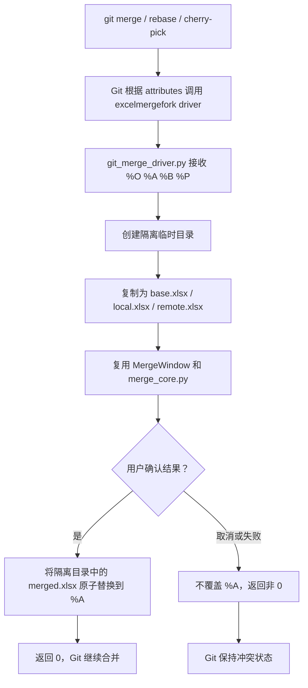

# Git 全局 Excel 合并驱动适配方案

> 状态：设计草案，暂未实现
> 日期：2026-05-31
> 目标版本：待排期

## 1. 背景

当前项目主要面向 Fork 客户端：

- 合并模式接收 `LOCAL BASE REMOTE MERGED` 四个路径，打开 Excel 三向合并 GUI。
- 用户确认结果后，`Scripts/git_util.py` 会执行 `git add`，并清理 Fork 生成的临时文件。
- 对比模式接收两个路径，生成 Excel 对比结果。

这套流程适合 Fork 的 External Merge Tool，也可以注册为 `git mergetool`。但它不能直接作为 Git 的底层 merge driver 使用。

Git 底层 merge driver 的调用时机更早：`git merge`、`git rebase`、`git cherry-pick` 等命令在处理文件级合并时会直接调用驱动程序。Git 要求驱动程序：

1. 接收共同祖先 `%O`、当前分支版本 `%A`、待合入版本 `%B` 和仓库内路径 `%P`。
2. 将合并结果写回 `%A`。
3. 合并成功时返回 `0`，取消或无法完成时返回非 `0`。
4. 不在驱动内部执行 `git add`，不删除 Git 管理的临时文件。

因此，需要在保留现有 Fork 行为的前提下，增加一个专用适配层。

## 2. 目标与非目标

### 2.1 目标

- 用户安装一次后，对本机所有 Git 仓库中的 `*.xlsx` 文件生效。
- 当 Excel 文件需要进行文件级三向合并时，Git 默认调用本工具。
- 保持现有 Fork Merge Tool、Fork Diff Tool 和命令行用法兼容。
- 继续复用现有 Excel 冲突检测、合并选项、GUI 和备份能力。
- 安装与卸载脚本可重复执行，不覆盖用户已有的全局 attributes 内容。
- 用户取消 GUI 或合并失败时，Git 保持冲突状态，不误报成功。

### 2.2 非目标

- 不接管 `.xls`：`openpyxl` 不支持旧版 Excel 二进制格式。
- 首期不接管 `.xlsm`：现有保存流程没有保证 VBA 宏完整保留。
- 不自动修改每个仓库中的 `.gitattributes`。
- 不改变现有 Excel 合并算法、冲突判断规则或 GUI 默认选项。
- 不自动解决所有冲突并静默提交，仍要求用户确认合并结果。
- 不在本方案阶段实现代码或执行全局 Git 配置。

### 2.3 非功能约束

- **兼容性**：继续支持 Python 3.7+ 和 Windows 单文件 exe 分发。
- **安全性**：Git driver 模式只写回 `%A`，取消或失败时不得误报成功。
- **可恢复性**：生成结果前保留隔离副本，写回时使用原子替换。
- **可运维性**：安装、重复安装和卸载均有明确日志及校验结果。
- **低侵入性**：不覆盖用户已有 attributes 内容，不改变现有 Fork 默认行为。

## 3. 可选方案

### 3.1 方案 A：仅注册全局 `git mergetool`

直接复用当前 exe：

```powershell
git config --global merge.tool excelmergefork
git config --global mergetool.excelmergefork.cmd '"D:/Tools/ForkExcelMergeTool/ExcelMergeFork.exe" "$LOCAL" "$BASE" "$REMOTE" "$MERGED"'
git config --global mergetool.excelmergefork.trustExitCode true
```

优点：

- 当前版本即可使用。
- 改动最少，风险较低。

缺点：

- 发生冲突后仍需手动执行 `git mergetool`。
- 无法做到执行普通 Git 合并命令时自动接管 Excel 文件。

### 3.2 方案 B：新增全局底层 merge driver

增加 `--git-merge-driver` 入口，通过 Git 全局 attributes 文件将 `*.xlsx` 绑定到本工具。

优点：

- 满足“一次安装，所有仓库默认生效”的目标。
- 不依赖 Fork，命令行 Git 和其他遵循 Git 合并机制的客户端都可使用。
- 仓库可以用自身 `.gitattributes` 覆盖全局默认值。

缺点：

- 需要新增适配层，严格区分 Fork 流程和 Git driver 流程。
- GUI 会在 `git merge` 等 Git 操作执行期间阻塞等待用户处理。
- 安装脚本需要谨慎维护用户级 Git 配置。

### 3.3 方案 C：每个仓库提交 `.gitattributes`

在需要使用工具的仓库中提交：

```text
*.xlsx merge=excelmergefork
```

优点：

- 仓库行为明确，可由团队共同约定。
- 不会影响其他仓库。

缺点：

- 每个仓库都要单独改动。
- 仍然需要每台电脑安装并注册 driver。
- 不符合“全局通用”的主要诉求。

### 3.4 决策

推荐实现方案 B，同时保留方案 A 作为手动兜底方式。方案 C 可由具体仓库按需采用，不作为默认安装流程。

## 4. 总体设计

### 4.1 Git 配置结构

安装脚本注册用户级 merge driver：

```powershell
git config --global merge.excelmergefork.name "ExcelMergeFork workbook merge driver"
git config --global merge.excelmergefork.driver '"D:/Tools/ForkExcelMergeTool/ExcelMergeFork.exe" --git-merge-driver "%O" "%A" "%B" "%P"'
git config --global merge.excelmergefork.recursive binary
```

用户级 attributes 文件增加：

```text
# ExcelMergeFork managed entry
*.xlsx merge=excelmergefork
*.XLSX merge=excelmergefork
```

`recursive=binary` 用于存在多个共同祖先时的内部合并。最终文件级合并仍由 `excelmergefork` 驱动处理。

### 4.2 全局 attributes 文件选择

安装脚本按以下顺序确定文件：

1. 若 `git config --global --get core.attributesFile` 已配置，使用该文件。
2. 否则使用 Git 默认用户级路径：`%USERPROFILE%\.config\git\attributes`。
3. 创建缺失目录和文件。
4. 只追加缺少的 managed entry，不覆盖已有内容，不重复写入。

卸载脚本只删除本工具写入的两条规则和相邻 managed 注释，不删除用户的其他规则。若 attributes 文件因此变为空文件，可以保留空文件。

仓库自身的 `.gitattributes` 优先级高于用户级 attributes。需要禁用全局默认值时，仓库可显式覆盖该属性。

### 4.3 新增命令行入口

新增专用调用形式：

```text
ExcelMergeFork.exe --git-merge-driver <base> <current> <other> <repo-path>
```

参数映射：

| 参数 | Git 占位符 | 含义 |
|------|------------|------|
| `base` | `%O` | 共同祖先版本 |
| `current` | `%A` | 当前分支版本，也是 Git 要求覆盖的输出文件 |
| `other` | `%B` | 待合入分支版本 |
| `repo-path` | `%P` | 工作区内逻辑路径，仅用于展示、日志和备份定位 |

现有四参数模式保持不变：

```text
ExcelMergeFork.exe <local> <base> <remote> <merged>
```

## 5. 适配层职责

新增 `Scripts/git_merge_driver.py`，负责隔离 Git driver 契约与现有 GUI。

### 5.1 数据流



### 5.2 为什么必须使用隔离临时目录

Git 要求 `%A` 同时作为当前分支输入和最终输出。现有合并流程通常假设输入与输出路径相互独立，并且 GUI 确认逻辑会清理临时文件。

适配层应先复制输入：

```text
driver_temp\
  base.xlsx
  local.xlsx
  remote.xlsx
  merged.xlsx
```

GUI 只操作这些隔离文件。用户确认后，再将 `merged.xlsx` 原子替换到 `%A`。这样可以：

- 避免尚未确认时提前覆盖 Git 输入。
- 避免现有流程误删 Git 提供的文件。
- 保证写入失败时 `%A` 仍可恢复。
- 为路径中包含空格、中文和无 `.xlsx` 后缀的 Git 临时文件提供稳定输入。

### 5.3 完成策略

`MergeWindow` 需要引入可注入的完成策略，默认保持当前行为。

| 场景 | 生成结果 | 用户确认后行为 |
|------|----------|----------------|
| Fork / 现有四参数模式 | 写入 `MERGED` | 执行 `stage_merged_and_cleanup()` |
| Git driver 模式 | 写入隔离目录中的 `merged.xlsx` | 原子替换 `%A`，不执行任何 Git 命令 |

建议将默认策略保留为 `ForkCompletionStrategy`，新增 `GitDriverCompletionStrategy`。首期也可以使用简单回调实现，但策略对象更容易集中处理退出码、日志和清理。

### 5.4 退出码

| 退出码 | 含义 | Git 行为 |
|--------|------|----------|
| `0` | 用户已确认，结果已成功写回 `%A` | 继续合并 |
| `1` | 用户取消、输入缺失或无法完成合并 | 保持冲突状态 |
| `2` | 工具内部异常 | 保持冲突状态，并写日志 |

驱动模式不得因为 GUI 关闭、文件被 Excel 占用或备份失败而返回 `0`。

## 6. 备份与日志

### 6.1 备份路径

驱动模式下，实际输出位于隔离临时目录，但备份目录不能跟随临时目录。

需要扩展 `backup_util.py`，将“备份源文件”和“用于确定项目及默认备份目录的逻辑目标路径”分开：

- 备份源：隔离目录中的 `local.xlsx`、`remote.xlsx` 和 `merged.xlsx`。
- 逻辑目标：根据 `%P` 和 Git 工作目录解析出的工作区文件路径。
- 自定义备份根目录：继续读取现有 `merge_options.json`。
- 未设置自定义目录时：继续使用逻辑目标所在目录下的 `MergeExcelBackup`。

### 6.2 日志

日志需增加 driver 上下文，至少记录：

- 调用模式：`fork` 或 `git-driver`。
- `%P` 逻辑路径。
- 输入文件是否存在。
- 隔离目录创建和清理结果。
- 用户确认、取消或异常退出。
- 写回 `%A` 是否成功。

日志不得记录工作簿内容。

## 7. 安装与卸载脚本

### 7.1 建议文件

| 文件 | 职责 |
|------|------|
| `install_git_integration.bat` | Windows 双击入口 |
| `uninstall_git_integration.bat` | Windows 双击卸载入口 |
| `Scripts/install_git_integration.ps1` | 写入 Git 全局配置和 attributes |
| `Scripts/uninstall_git_integration.ps1` | 只撤销本工具维护的配置 |

### 7.2 安装脚本要求

- 默认使用脚本同目录下的 `ExcelMergeFork.exe`。
- 可通过参数指定 exe 完整路径。
- 写配置前检查 exe 是否存在。
- 将 exe 路径规范化为 Git 兼容的正斜杠形式。
- 正确引用包含空格或中文的路径。
- 重复执行时不产生重复 attributes 行。
- 若发现 `merge.excelmergefork.*` 已存在但指向不同路径，输出旧值和新值后再更新。
- 完成后执行只读校验并输出结果。

建议校验命令：

```powershell
git config --global --get merge.excelmergefork.driver
git check-attr merge -- example.xlsx
```

### 7.3 卸载脚本要求

- 删除 `merge.excelmergefork.name`、`merge.excelmergefork.driver` 和 `merge.excelmergefork.recursive`。
- 只删除 attributes 文件中由本工具维护的规则。
- 不删除 `merge.tool`，除非它当前明确等于 `excelmergefork` 且脚本提示用户确认。
- 不修改 Fork 客户端的配置。

## 8. 预计代码改动

| 文件 | 预计改动 |
|------|----------|
| `Scripts/MergeExcelFork.py` | 在现有参数规范化前识别 `--git-merge-driver` |
| `Scripts/git_merge_driver.py` | 新增 driver 适配层、隔离目录、原子写回和退出码处理 |
| `Scripts/merge_gui.py` | 支持注入完成策略；driver 模式不执行 `git add` 或临时文件清理 |
| `Scripts/backup_util.py` | 支持使用逻辑目标路径定位备份目录 |
| `Scripts/log_util.py` | 如有需要，增加 driver 上下文日志辅助函数 |
| `Scripts/make_python_zip.ps1` | 将新增 Python 模块加入轻量包 |
| `ExcelMergeFork.spec` | 确认 PyInstaller 包含新增模块 |
| `install_git_integration.bat` | 新增安装入口 |
| `uninstall_git_integration.bat` | 新增卸载入口 |
| `Scripts/install_git_integration.ps1` | 新增幂等安装逻辑 |
| `Scripts/uninstall_git_integration.ps1` | 新增保守卸载逻辑 |
| `README.md` | 增加全局 Git 集成说明、启用范围和卸载方式 |
| `CLAUDE.md` | 补充 driver 模式架构和开发验证命令 |

合并算法模块 `Scripts/merge_core.py` 原则上不改行为，只按备份上下文需要做最小参数扩展。

## 9. 风险与缓解措施

| 风险 | 影响 | 缓解措施 |
|------|------|----------|
| driver 模式误执行 `git add` | Git 合并期间可能遇到索引锁，或破坏状态 | 完成策略严格分流，driver 模式禁止调用 `git_util.py` |
| driver 模式删除 `%O/%A/%B` | Git 临时文件丢失，合并异常 | GUI 只接触隔离副本，Git 提供的输入只读 |
| 用户取消后仍返回成功 | Git 误认为冲突已解决 | 只有确认并成功写回 `%A` 后返回 `0` |
| 备份写入临时目录 | 合并后备份丢失 | 使用 `%P` 解析出的逻辑目标定位备份目录 |
| exe 移动位置 | 全局配置失效 | 安装脚本显示当前路径，可重复运行以更新 |
| 全局规则影响不希望接管的仓库 | 用户无法使用其他工具 | 仓库 `.gitattributes` 可覆盖；提供卸载脚本 |
| `.xlsm` 保存后宏丢失 | 工作簿损坏 | 首期只匹配 `.xlsx` 和 `.XLSX` |
| Git 在非交互环境中触发 driver | CI 或脚本可能等待 GUI | README 明确全局启用影响；提供快速卸载和仓库级覆盖方法 |
| 路径包含空格、中文或特殊字符 | driver 无法启动 | 安装脚本统一转义；测试覆盖复杂路径 |

## 10. 安全考虑

- driver 只允许覆盖 Git 传入的 `%A`，不得根据 `%P` 直接覆盖任意路径。
- `%P` 仅用于显示、日志和备份目录推导；使用前应规范化并验证仍位于当前工作区。
- 隔离目录使用系统临时目录和随机名称创建。
- 原子替换前检查结果文件存在且可读取。
- 安装脚本不拼接未转义的 shell 命令。
- 卸载脚本不得删除 attributes 文件中的非本工具内容。
- 日志中不写入工作簿内容或敏感单元格数据。

## 11. 验证计划

### 11.1 现有回归

```bat
run_quick_test.bat
run_merge_mode_tests.bat
```

确认现有 Fork 四参数模式、对比模式和合并算法行为不变。

### 11.2 driver 模式测试

新增临时 Git 仓库测试，至少覆盖：

1. 安装脚本首次执行、重复执行和卸载。
2. `git check-attr merge -- example.xlsx` 返回 `excelmergefork`。
3. `.txt`、`.xls`、`.xlsm` 不匹配 driver。
4. 两个分支修改同一个 `.xlsx` 后执行 `git merge`，工具 GUI 被调用。
5. 用户确认后 `%A` 被正确写回，Git 继续完成文件级合并。
6. 用户取消后 driver 返回非 `0`，Git 保持冲突状态。
7. 输入路径包含空格和中文。
8. 工作簿被 Excel 占用时返回失败，不误报成功。
9. 多个 `.xlsx` 文件冲突时依次处理，单实例锁能正确释放。
10. 仓库级 `.gitattributes` 覆盖全局规则后，本工具不再接管。

### 11.3 手工验证命令

```powershell
git config --global --get merge.excelmergefork.driver
git check-attr merge -- example.xlsx
git status
```

## 12. ADR 决策记录

### ADR-001：使用专用底层 merge driver 模式

- **上下文**：现有四参数入口适用于 Fork 和 `git mergetool`，但完成时会执行 `git add`。
- **决策**：新增 `--git-merge-driver`，不复用现有四参数入口的完成行为。
- **后果**：需要一个适配模块和完成策略分流，但可以安全支持普通 Git 合并命令自动接管 Excel。

### ADR-002：隔离 Git 提供的输入文件

- **上下文**：Git 要求 `%A` 同时作为当前版本输入和驱动输出，现有核心通常使用独立输入输出路径。
- **决策**：先复制 `%O/%A/%B` 到随机临时目录，GUI 只操作副本，确认后原子替换 `%A`。
- **后果**：增加少量磁盘复制开销，换取更清晰的边界、失败恢复能力和路径兼容性。

### ADR-003：保守维护用户级 attributes

- **上下文**：用户可能已有全局 attributes 配置，工具不应覆盖或删除无关内容。
- **决策**：优先使用用户已配置的 `core.attributesFile`，否则使用 Git 默认路径；安装只追加缺失规则，卸载只删除 managed entry。
- **后果**：安装脚本稍复杂，但可重复执行且不会破坏用户配置。

## 13. 分阶段实施建议

### 阶段 1：driver 适配层

- 新增 `--git-merge-driver` 参数入口。
- 增加隔离目录和 `%A` 原子写回。
- 将 GUI 确认行为拆分为 Fork 与 driver 两种完成策略。
- 补齐取消和异常退出码。

### 阶段 2：备份与日志

- 使用逻辑目标路径定位备份目录。
- 增加 driver 上下文日志。
- 验证临时目录清理。

### 阶段 3：安装、卸载与文档

- 增加幂等安装和保守卸载脚本。
- 增加全局 attributes 配置。
- 更新 README 和轻量分发包。

### 阶段 4：回归与发布

- 运行现有合并模式测试。
- 增加临时 Git 仓库集成测试。
- 重新打包 exe，验证 Fork 和 Git 两种入口。

## 14. 验收标准

- 执行一次安装脚本后，新旧 Git 仓库中的 `.xlsx` 文件都默认匹配 `excelmergefork`。
- 普通 `git merge` 遇到需要文件级合并的 `.xlsx` 时会打开本工具。
- 用户确认后 Git 可以继续合并；用户取消后 Git 保持冲突。
- driver 模式不会执行 `git add`，不会删除 Git 管理的临时文件。
- Fork 原有四参数合并与二参数对比行为不变。
- 安装脚本重复执行无副作用，卸载脚本不会删除用户自定义 attributes。
- `.xls` 和 `.xlsm` 不会被默认接管。

## 15. 参考资料

- Git 官方文档：[gitattributes - Defining a custom merge driver](https://git-scm.com/docs/gitattributes)
- Git 官方文档：[git-config - core.attributesFile](https://git-scm.com/docs/git-config#Documentation/git-config.txt-coreattributesFile)
- Git 官方文档：[git-mergetool](https://git-scm.com/docs/git-mergetool)
